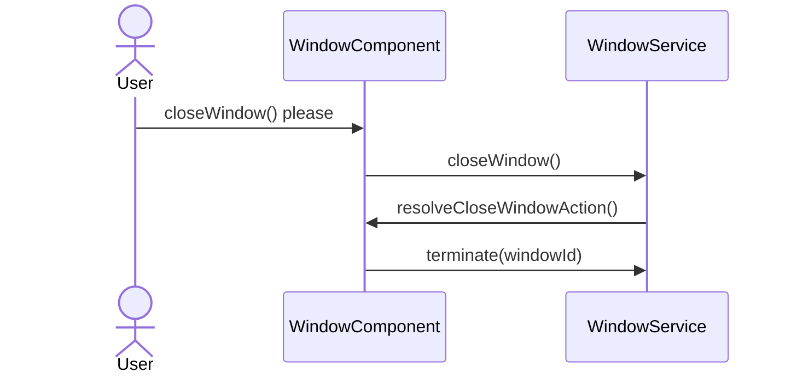
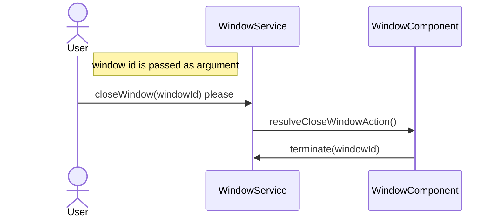

# Dynamic Windows
## About
## Getting started

### Install Dynamic Windows

Use the Angular CLI's installation schematic to set up your Dynamic Windows project
by running the following command:

```
ng add dynamic-windows-core
```

 or

```
npm install dynamic-windows-core
```


### Initiate a window service

First you have to specify what dom element should act as a "**display**"

```html
<!-- app.component.html -->
<div ngModel #vcr></div>
```

```ts
// app.component.ts
@Component(...)
export class AppComponent implements AfterViewInit {

    @ViewChild("vcr", {read: ViewContainerRef})
    vcr!: ViewContainerRef;

    constructor(private windowsStore: WindowStoreService<DynamicWindow>) {}

    ngAfterViewInit(): void {
        this.windowsStore.setWindowContainerRef(this.vcr);
    }
}
```

### Create a window
```html
<!-- window.component.html -->
<div style="background-color: blueviolet; height: 100px; width: 100px;">
  This is a Window!
</div>
```

```ts
// window.component.ts

@Component(...)
export class WindowComponent extends DynamicWindow {

    constructor() {
        super();
    }
}
```

```ts
// app.component.ts
...

this.windowStore.createWindow(WindowComponent);

...
```

### Close a window
The simplest way to close a window is to call **closeWindow()** method 
which is defined in DynamicWindow class.
So for example we'll add a button calling this method.
```html
<!-- window.component.html -->
  <button (click)="this.closeWindow()">Close me!</button>

```

## Overriding default methods
It is possible to override the default behavior when closing a window. For example:

When you have a text editor with unsaved changes,
you probably should ask for a confirmation before closing and act accordingly.

To do that you'll need
to override "**resolveCloseWindowAction()**" method and add your logic there.

Generally the recommended way of closing a window
in an overridden method is to call `super.resolveCloseWindowAction();`.

The process of closing a window from inside the component is shown in the diagram below:



```ts
 override resolveCloseWindowAction() {
    if (window.confirm("Are u sure?")){
      super.resolveCloseWindowAction();
    }
  }
```

## Closing window from outside the component 

Note that closing a window from outside the component requires window id.
A way to get the window id is to save it while creating a component because
createWindow method returns `ComponentRef<any>`.
This is shown in the example below:

```ts
// app.component.ts
...

// You can access the created window from this variable.
const cRef: ComponentRef<any> = this.windowStore.createWindow(WindowComponent);
const windowId: number = cRef?.instance.id;

...
```
The process of closing a window from outside the component is shown in the diagram below:





## Configuration

## Create window from html content
```ts
...

    // Create HTML element/s:
    let e = document.createElement("ul");
    let e2 = document.createElement("li");
    e2.innerText ="element 1 ";
    let e3 = document.createElement("img");
    e3.src = "assets/img.png";
    e3.width = 100;
    e.appendChild(e2);
    e.appendChild(e3);

    // Create window from HTML element:
    this.windowsStore.createWindowFromHtmlElement(e);
...
```

Note, that you can create multiple windows from the same HTML element, 
because while creating a window, the HTML element is cloned into it. 

## Window structure

### Component structure
To create a custom window you should extend `DynamicWindow` base class.
Then you can style your window in **.html** and **.css** files.

`DynamicWindow` class gives you access to WindowService instance, stores your window id, 
and provides basic functionality to manage your window from within the component.
```ts
@Component(...)
export class WindowComponent extends DynamicWindow {

  constructor() {
    super();
  }
}
```

### Template structure

Although `dw-windowframe` attribute is optional, if you'd like your window to be resizable,
draggable and focusable out of the box we encourage you to use this attribute: 

```html
<div dw-windowframe>
  ...
</div>
```
Attribute `dw-windowframe` contains other attributes with default settings:

#### `dw-windowframe` = `dw-resizable` + `dw-focusable` + `dw-draggable`

## Resizable window
By default, windows cannot be resized, to enable resizing add a `dw-resizable` attribute.

```html
<div dw-resizable>
  ...
</div>
```
This will add to your HTML element set of invisible html elements, which we'll call anchors:
# obrazek z anchorami

As you can see, there are eight of them, four edge anchors, and four corner anchors.

### Setting custom anchor size
If you want to customize the size of the resizing anchors, you can specify `anchor-size` property
by passing a number in px. (the default anchor size is 10px)

```html
<div dw-resizable anchor-size="50">
  ...
</div>
```

## Draggable window
To enable the window to be moved around, add a `dw-draggable` directive to it.

```html
<div dw-draggable>
  ...
</div>
```

### Defining custom draggable space
You can exclude certain parts of your window from being a draggable space, 
dw-draggable affects all child elements, 
but you can prevent them from becoming a hook for dragging using `non-draggable-space` attribute,
for example you might want elements like `<textarea>` to respond to `mousedown` event in a canonical way.

Furthermore, you can set `recursive` value on a `non-draggable-space` property to affect all child nodes.
```html
<div dw-draggable>
  ...
  <div dw-draggable-space>
    ...
    <textarea dw-non-draggable-space ></textarea>
    ...
    <div dw-non-draggable-space="recursive">
      <div></div> <-- This div will be also treated as non-draggable space.
    </div>
    ...
    <div dw-non-draggable-space >
      <div></div> <-- Note, that you can still drag the window
                      using this element as a hook.
    </div>
    ...
  </div>
  ...
</div>
```

## Focusable window
The window defined as `dw-focusable` will be pulled above other windows when clicked.
This directive should be applied on the window frame:

```html
<div dw-focusable>
  ...
</div>
```

## Saving windows state to local storage
