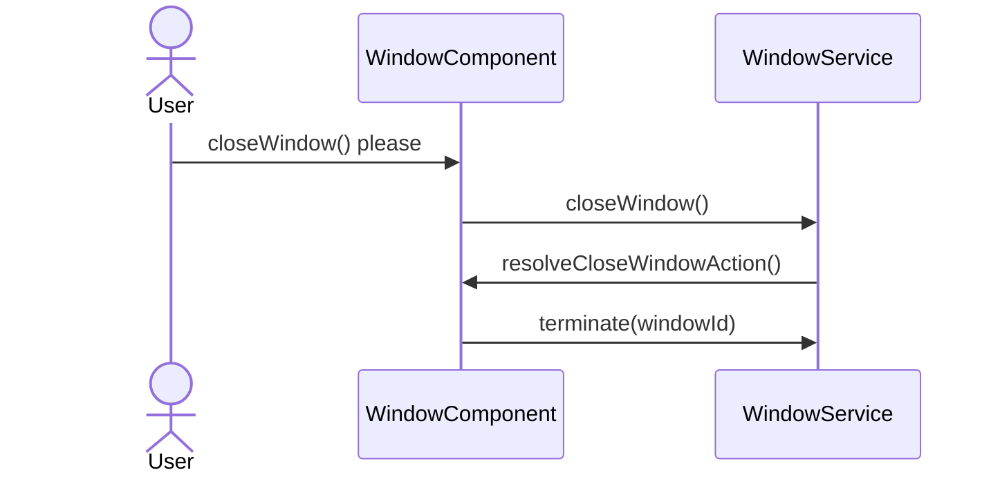
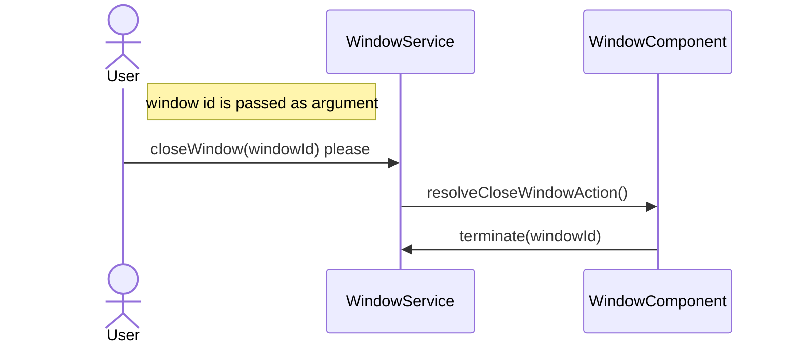

# Dynamic Windows
## About
## Getting started

### Install Dynamic Windows

Use the Angular CLI's installation schematic to set up your Dynamic Windows project
by running the following command:

```
ng add dynamic-windows-core
```

 or

```
npm install dynamic-windows-core
```


### Initiate a window service

First you have to specify what dom element should act as a "**display**"

```html
<!-- app.component.html -->
<div ngModel #vcr></div>
```

```ts
// app.component.ts
@Component(...)
export class AppComponent implements AfterViewInit {

    @ViewChild("vcr", {read: ViewContainerRef})
    vcr!: ViewContainerRef;

    constructor(private windowsStore: WindowStoreService<DynamicWindow>) {}

    ngAfterViewInit(): void {
        this.windowsStore.setWindowContainerRef(this.vcr);
    }
}
```

### Create a window
```html
<!-- window.component.html -->
<div style="background-color: blueviolet; height: 100px; width: 100px;">
  This is a Window!
</div>
```

```ts
// window.component.ts

@Component(...)
export class WindowComponent extends DynamicWindow {

    constructor() {
        super();
    }
}
```

```ts
// app.component.ts
...

this.windowStore.createWindow(WindowComponent);

...
```

### Close a window
The simplest way to close a window is to call **closeWindow()** method 
which is defined in DynamicWindow class.
So for example we'll add a button calling this method.
```html
<!-- window.component.html -->
  <button (click)="this.closeWindow()">Close me!</button>

```

## Overriding default methods
It is possible to override the default behavior when closing a window. For example:

When you have a text editor with unsaved changes,
you probably should ask for a confirmation before closing and act accordingly.

To do that you'll need
to override "**resolveCloseWindowAction()**" method and add your logic there.

Generally the recommended way of closing a window
in an overridden method is to call `super.resolveCloseWindowAction();`.

The process of closing a window from inside the component is shown in the diagram below:



```ts
 override resolveCloseWindowAction() {
    if (window.confirm("Are u sure?")){
      super.resolveCloseWindowAction();
    }
  }
```

## Closing window from outside the component 

Note that closing a window from outside the component requires window id.
A way to get the window id is to save it while creating a component because
createWindow method returns `ComponentRef<any>`.
This is shown in the example below:

```ts
// app.component.ts
...

// You can access the created window from this variable.
const cRef: ComponentRef<any> = this.windowStore.createWindow(WindowComponent);
const windowId: number = cRef?.instance.id;

...
```
The process of closing a window from outside the component is shown in the diagram below:





## Configuration

## Create window from html content
```ts
...

    // Create HTML element/s:
    let e = document.createElement("ul");
    let e2 = document.createElement("li");
    e2.innerText ="element 1 ";
    let e3 = document.createElement("img");
    e3.src = "assets/img.png";
    e3.width = 100;
    e.appendChild(e2);
    e.appendChild(e3);

    // Create window from HTML element:
    this.windowsStore.createWindowFromHtmlElement(e);
...
```

Note, that you can create multiple windows from the same HTML element, 
because while creating a window, the HTML element is cloned into it. 

## Window structure

### Component structure

```ts
@Component(...)
export class WindowComponent extends DynamicWindow {

  constructor() {
    super();
  }
}
```

### Template structure

```html
<div windowframe>
  ...
</div>
```

## Resizable window

```html
<div windowframe resizable>
  ...
</div>
```
## Draggable window

```html
<div windowframe draggable>
  ...
  <div draggable-space>
    <div non-draggable-space></div>
  </div>
  ...
</div>
```
## Saving windows state to local storage
